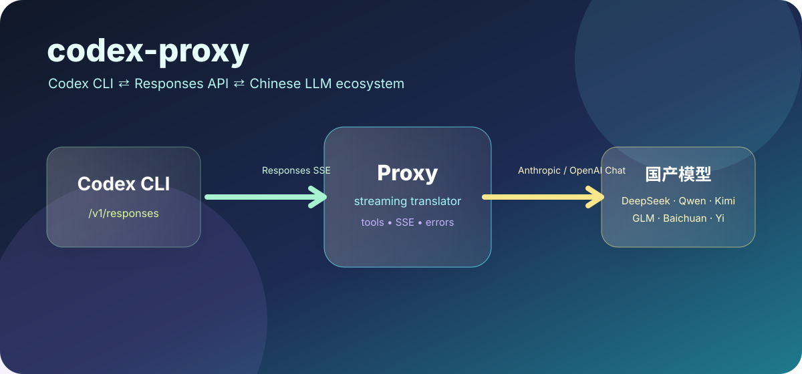
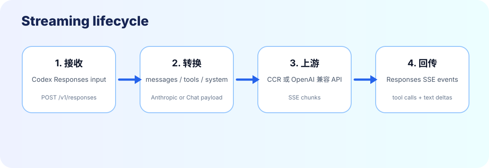

<div align="center">

# codex-proxy

<p>
  <strong>让 Codex CLI 接入国产大模型的轻量级流式协议代理。</strong><br>
  OpenAI Responses API ⇄ Anthropic Messages API / OpenAI Chat Completions API
</p>

<p>
  <a href="LICENSE"></a>
  
  
  
  
</p>

<p>
  <a href="#为什么需要它">为什么需要它</a> ·
  <a href="#功能亮点">功能亮点</a> ·
  <a href="#快速开始">快速开始</a> ·
  <a href="#配置国产模型">配置国产模型</a> ·
  <a href="#工作原理">工作原理</a> ·
  <a href="#测试与排错">测试与排错</a>
</p>



</div>

---

## 一句话说明

`codex-proxy` 是一个可审计、可脚本化、可部署在本机或服务器上的 Python 协议桥。它接收 Codex CLI 发出的 **OpenAI Responses API** 流式请求，再转换为上游国产模型生态常见的两类接口：

1. **Anthropic Messages API**：适合接入 CCR（Claude Code Router）以及 Anthropic-compatible 路由器。
2. **OpenAI Chat Completions API**：适合直接接入 DeepSeek、通义千问/Qwen、Kimi、智谱 GLM、百川、阶跃星辰、零一万物/Yi 等 OpenAI-compatible 服务。

> [!IMPORTANT]
> 这个项目不是密钥管理器，也不是 GUI 配置工具。它只做一件事：把 Codex CLI 的请求实时翻译成上游模型能理解的流式协议，并把上游返回再翻译回 Codex CLI 期待的 Responses SSE 事件。

---

## 为什么需要它

Codex CLI 默认面向 OpenAI Responses API，而很多国产模型服务暴露的是 OpenAI-compatible Chat Completions API；CCR 等路由器则常使用 Anthropic Messages API。两边的字段、工具调用结构、SSE 事件名称都不完全一致，所以仅改 `base_url` 经常不够。

`codex-proxy` 的定位是中间翻译层：

```text
Codex CLI  ── /v1/responses ──>  codex-proxy  ── Anthropic Messages 或 OpenAI Chat ──>  国产模型/路由器
```

适合你在以下场景使用：

- 想让 Codex CLI 使用 MiMo、DeepSeek、Qwen、Kimi、GLM 等模型。
- 已经在用 CCR，希望 Codex CLI 也复用同一套路由。
- 上游模型只提供 OpenAI-compatible Chat Completions，但 Codex CLI 需要 Responses API。
- 需要保留 streaming、工具调用、错误事件，而不是简单的非流式转发。
- 希望项目足够小，方便自己审计、修改和部署。

---

## 功能亮点

| 能力 | 说明 |
| :--- | :--- |
| **通用命名** | 项目已从 `codex-mimo-proxy` 升级为 `codex-proxy`，默认配置使用 `CODEX_PROXY_*` 环境变量。 |
| **两类上游协议** | `CODEX_PROXY_UPSTREAM=anthropic` 或 `CODEX_PROXY_UPSTREAM=openai`。 |
| **国产模型友好** | 支持大多数国产厂商的 OpenAI-compatible Chat Completions 接口，也支持通过 CCR 接入 provider/model 形式的路由。 |
| **流式响应** | 上游 SSE 会实时转换为 `response.output_text.delta`、`response.completed` 等 Responses API 事件。 |
| **工具调用** | Responses function tools ⇄ Anthropic `tool_use` / OpenAI `tool_calls`。 |
| **系统提示词合并** | `instructions`、`developer`、`system` 消息会合并成上游系统提示。 |
| **兼容旧入口** | `codex_mimo_proxy.py` 仍保留为 deprecated launcher，避免已有脚本立刻失效。 |
| **健康检查** | `GET /health` 返回当前代理名、上游类型和默认模型；`GET /v1/models` 返回当前默认模型。 |

---

## 快速开始

### 1. 安装依赖

```bash
git clone https://github.com/zeyuShawn/codex-proxy.git
cd codex-proxy

python3 -m venv .venv
.venv/bin/pip install -r requirements.txt
```

### 2. 选择上游模式

#### 模式 A：通过 CCR / Anthropic-compatible 路由器

```bash
export CODEX_PROXY_UPSTREAM=anthropic
export CODEX_PROXY_URL="http://127.0.0.1:3456/v1/messages"
export CODEX_PROXY_API_KEY="local-ccr-key"
export CODEX_PROXY_MODEL="mimo,mimo-v2.5-pro"
.venv/bin/python codex_proxy.py
```

#### 模式 B：直接连接 OpenAI-compatible 国产模型

下面以 DeepSeek 为例；Qwen、Kimi、GLM 等只需要替换 URL、API key 和模型名。

```bash
export CODEX_PROXY_UPSTREAM=openai
export CODEX_PROXY_URL="https://api.deepseek.com/chat/completions"
export CODEX_PROXY_API_KEY="你的上游 API Key"
export CODEX_PROXY_MODEL="deepseek-chat"
.venv/bin/python codex_proxy.py
```

### 3. 配置 Codex CLI

把 Codex CLI 指向本地代理：

```toml
model_provider = "codex-proxy"
model = "deepseek-chat"
model_context_window = 131072

[model_providers.codex-proxy]
name = "codex-proxy"
base_url = "http://127.0.0.1:5001/v1"
env_key = "CODEX_PROXY_API_KEY"
```

然后正常使用：

```bash
codex
codex exec "用中文解释这个仓库的架构"
codex -m "deepseek-chat" exec "写一个单元测试"
```

---

## 配置国产模型

### 环境变量

| 变量 | 默认值 | 说明 |
| :--- | :--- | :--- |
| `CODEX_PROXY_UPSTREAM` | `anthropic` | 上游协议。可选 `anthropic` 或 `openai`。 |
| `CODEX_PROXY_URL` | `http://127.0.0.1:3456/v1/messages` | 上游完整 endpoint。OpenAI-compatible 模式通常以 `/chat/completions` 结尾。 |
| `CODEX_PROXY_API_KEY` | `local-ccr-key` | 上游认证 key。Anthropic 模式发送为 `x-api-key`；OpenAI 模式发送为 Bearer token。 |
| `CODEX_PROXY_MODEL` | `mimo,mimo-v2.5-pro` | 默认模型名。也可由 Codex 请求中的 `model` 覆盖。 |
| `CODEX_PROXY_PORT` | `5001` | 本地监听端口。 |
| `CODEX_PROXY_HOST` | `127.0.0.1` | 本地监听地址。部署到容器时可设为 `0.0.0.0`。 |
| `CODEX_PROXY_TIMEOUT` | `180` | 上游请求超时秒数。 |
| `CODEX_PROXY_MAX_TOKENS` | `16384` | 转发给上游的默认最大输出 token 数。 |
| `CODEX_PROXY_DEBUG` | `0` | 设为 `1` 时写入 `proxy_debug.log`。注意日志可能包含提示词。 |

旧变量 `CCR_URL`、`CCR_API_KEY`、`MIMO_MODEL`、`MIMO_PORT`、`MIMO_DEBUG` 仍作为兼容 fallback 支持，但新配置应优先使用 `CODEX_PROXY_*`。

### 常见国产模型示例

> URL 可能随厂商版本变化而改变，请以各厂商控制台或官方文档为准。这里展示的是配置形态，不把 API key 写进仓库。

| 厂商/模型 | `CODEX_PROXY_UPSTREAM` | `CODEX_PROXY_URL` 示例 | `CODEX_PROXY_MODEL` 示例 |
| :--- | :--- | :--- | :--- |
| DeepSeek | `openai` | `https://api.deepseek.com/chat/completions` | `deepseek-chat` / `deepseek-reasoner` |
| Qwen / 通义千问 | `openai` | DashScope OpenAI-compatible `/chat/completions` endpoint | `qwen-plus` / `qwen3-coder-plus` |
| Moonshot / Kimi | `openai` | Moonshot OpenAI-compatible `/chat/completions` endpoint | `moonshot-v1-8k` / Kimi K2 系列模型名 |
| Zhipu / GLM | `openai` | 智谱 OpenAI-compatible `/chat/completions` endpoint | `glm-4` 系列模型名 |
| Baichuan | `openai` | 百川 OpenAI-compatible `/chat/completions` endpoint | 对应平台模型名 |
| StepFun / 阶跃星辰 | `openai` | 阶跃 OpenAI-compatible `/chat/completions` endpoint | 对应平台模型名 |
| Yi / 零一万物 | `openai` | Yi OpenAI-compatible `/chat/completions` endpoint | 对应平台模型名 |
| CCR 聚合路由 | `anthropic` | `http://127.0.0.1:3456/v1/messages` | `provider,model` |

---

## 工作原理



### 请求转换

Codex CLI 发来的 Responses 请求大致包含：

- `model`
- `instructions`
- `input[]`
- `tools[]`
- `tool_choice`
- `max_output_tokens`

代理会执行以下转换：

1. 把 `instructions`、`developer`、`system` 消息合并为上游系统提示。
2. 把 `input` 中的 user/assistant message 归一化为上游消息列表。
3. 把 `function_call` 和 `function_call_output` 转换为 Anthropic `tool_use/tool_result` 或 OpenAI `tool_calls/tool`。
4. 把 Responses `tools` 转换为 Anthropic `input_schema` 或 OpenAI `function.parameters`。
5. 打开上游 SSE 流，并逐块转成 Responses SSE 事件。

### 响应事件

代理会生成 Codex CLI 需要的事件，例如：

- `response.created`
- `response.in_progress`
- `response.output_item.added`
- `response.content_part.added`
- `response.output_text.delta`
- `response.function_call_arguments.delta`
- `response.function_call_arguments.done`
- `response.output_item.done`
- `response.completed`
- `response.failed`

---

## 项目结构

```text
.
├── assets/
│   ├── codex-proxy-hero.svg      # README 顶部视觉图
│   └── protocol-flow.svg         # 协议生命周期图
├── tests/
│   └── test_codex_proxy.py       # payload 与 SSE 转换单元测试
├── codex_proxy.py                # 主程序：Responses ⇄ Anthropic/OpenAI-compatible
├── codex_mimo_proxy.py           # 兼容旧文件名的启动器
├── requirements.txt              # 运行与测试依赖
├── README.md
└── LICENSE
```

---

## 与 CC Switch / CCR 的关系

| 工具 | 解决的问题 | 是否替代 codex-proxy |
| :--- | :--- | :--- |
| CC Switch | 管理多个 CLI 工具的 provider 配置 | 不替代。它是配置工具，不做协议流式翻译。 |
| CCR | 聚合和路由 Anthropic-compatible provider/model | 不替代。`codex-proxy` 可以把 Codex CLI 接到 CCR。 |
| codex-proxy | Responses API 与上游模型协议之间的实时转换 | 专注协议桥，不管理 provider 清单。 |

推荐组合：

```text
Codex CLI → codex-proxy → CCR → 具体国产模型
```

或者：

```text
Codex CLI → codex-proxy → DeepSeek/Qwen/Kimi/GLM 等 OpenAI-compatible endpoint
```

---

## 测试与排错

### 运行测试

```bash
python -m pytest -q
python -m py_compile codex_proxy.py codex_mimo_proxy.py
```

### 健康检查

代理启动后：

```bash
curl http://127.0.0.1:5001/health
curl http://127.0.0.1:5001/v1/models
```

示例返回：

```json
{"ok":true,"name":"codex-proxy","upstream":"openai","model":"deepseek-chat"}
```

### 最小请求

```bash
curl -N http://127.0.0.1:5001/v1/responses \
  -H 'Content-Type: application/json' \
  -d '{"model":"deepseek-chat","input":"你好，用一句话介绍你自己"}'
```

### 常见问题

| 现象 | 可能原因 | 修复建议 |
| :--- | :--- | :--- |
| `response.failed` 且包含 401/403 | 上游 API key 错误 | 检查 `CODEX_PROXY_API_KEY`。 |
| 上游 404 | `CODEX_PROXY_URL` 不是完整 endpoint | OpenAI-compatible 模式通常需要完整 `/chat/completions`。 |
| Codex 没有工具调用结果 | 上游模型不支持或未正确返回 tool calls | 先用简单工具测试；确认模型支持 function calling。 |
| 日志里有敏感提示词 | 开启了 debug | 关闭 `CODEX_PROXY_DEBUG` 并删除 `proxy_debug.log`。 |
| 外部机器无法访问 | 默认只监听 `127.0.0.1` | 容器/服务器部署时设置 `CODEX_PROXY_HOST=0.0.0.0`，并自行加反向代理/鉴权。 |

---

## 已知边界

我对本仓库当前可观察代码路径进行了静态审计和单元测试，但任何协议代理都无法在没有真实上游账号、真实 Codex CLI 版本矩阵和所有厂商 endpoint 的情况下宣称数学意义上的 100% 覆盖。当前项目事实层面的信心来自：

- 请求构造路径有单元测试覆盖 Anthropic 与 OpenAI-compatible 两种上游。
- 流式响应路径有单元测试覆盖文本增量、Anthropic tool_use、OpenAI SSE 结束事件。
- 旧 `codex_mimo_proxy.py` 入口保留，降低改名破坏性。
- README 明确区分协议桥、CCR、配置工具和上游模型。

仍建议你在实际使用的每个国产模型上跑一次端到端冒烟测试，尤其是 function calling、长上下文和推理模型输出格式。

---

## 安全建议

- 不要把真实 API key 提交到仓库。
- 不要在公网裸露本代理；如需远程访问，请放在 VPN、SSH tunnel 或带鉴权的反向代理后面。
- Debug 日志可能包含提示词、工具参数和模型输出，排错后应关闭并删除。
- 对工具调用保持最小权限原则；Codex CLI 侧工具能执行什么，上游模型就可能请求执行什么。

---

## License

MIT License. See [LICENSE](LICENSE).
